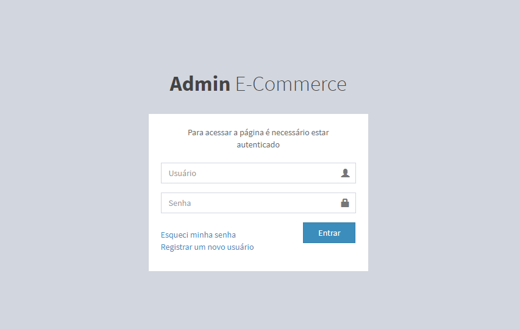
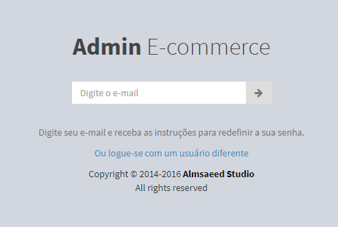
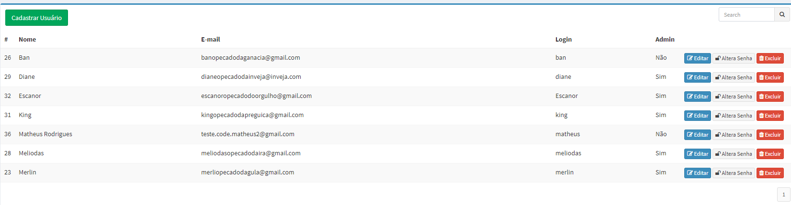

# Projeto E-commerce

Projeto fictício de site E-Commerce completo. Envolvendo uma rota de administração e o site de vendas em si. Crud, autenticação do usuário, consumo de webservices com Json e xml, integração com pagseguro e validações de formulário são algumas das características do projeto. Todo o trabalho feito não utiliza frameworks robustos, apenas um mini framework para rotas e um para a montagem das views (HTML). De restante somente codificações de PHP/MySql e muita orientação a objetos.

Ferramentas utilizadas: Slim 2.0 (Para rotas), RainTPL 3.0 (Para as views) e PHPMailer (Para envio de E-mails)

Projeto desenvolvido do zero no Curso de PHP 7 disponível na plataforma da Udemy

Template usado no projeto Almsaeed Studio

## Login de administração

## Esqueci a senha

## Registrar um novo usuário

## Crud de usuário

## Consumo de Webservices calculando Frete automaticamente
